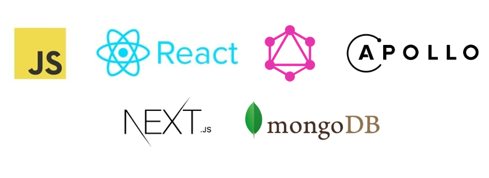

<h1 align="center">GraphQL + Apollo + Next.js + React + MongoDB</h1>

Complete example of using Next.js with GraphQL, Apollo and MongoDB

## What is it?

This project aims to show how you can use Next.js in conjunction with GraphQL, Apollo and MongoDB. 

The Hearthstone card database is used as an example.

## Setting up development environment

- Create a database in [MongoDB](https://www.mongodb.com/) named `hearthstone-now`.
- `git clone https://github.com/rettimo/nextjs-graphql-apollo-mongodb-example.git`
- Create an empty `.env` file, copy `.env.example` contents into it, and fill in your database name, username and password.
- `yarn install`
- `yarn run dev`
- App should now be running on `http://localhost:3000/`

## Disclaimer

This is just a demo project that does not claim to be true. I strongly discourage using it in production projects. Check yourself any information presented on the Internet!

If you have any questions regarding the project, please let me know therettimo@gmail.com

